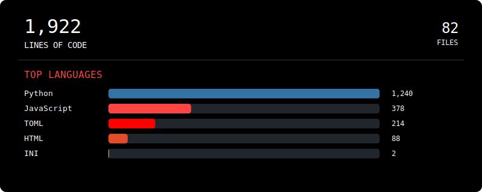

# About Me:
 # Hi, I'm Carlos (zappybird)  
Cybersecurity student • Ethical hacker • Always building & learning

<!-- LOC-STATS:START -->

<!-- LOC-STATS:END -->

---

# Tech Stack:

  
   
   
   
  
   
   
   
   
   
   
  

---

# GitHub Stats:

<!-- Streak Stats (Dark Mode) -->

---

## Contribution Snake

---

 
  <pre style="font-size:3px; line-height:3px;">

                                                  
                               @%                 
                              @@@@                
                              @@                  
                              @@                  
                             %@                   
                            %@                    
                            %@                    
                           @@                     
                 @%#*#%%%%*@@                     
                        #*%@@@@                   
                        *%@@  @@%                 
                       #%@@      @@               
                       *@@@                       
                      *@@@                        
                     *#%@                         
                     #@@@       @@@@              
                    *@@@      @@                  
                   @%@@@@@@@@@                    
                   #@@  @@@@      @@              
                  #@@@@@@                         
                  @@@@@                           
                 %@@                              
                                                  
                                                  
                                                  
                                                                                   
</pre> 

⠀
