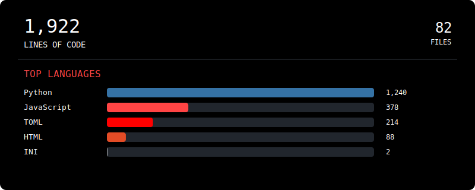

# Hi, I'm Carlos (zappybird)

Cybersecurity student • Ethical hacker • Always building & learning

<table>
<tr>
<td colspan="2" align="center">
  
</td>
</tr>
<tr>
<td width="50%" align="center">
  
</td>
<td width="50%" align="center">
  
</td>
</tr>
</table>

<!-- LOC-STATS:START -->

<!-- LOC-STATS:END -->

---

## Tech Stack

  
  
  
  
  
  
  
  
  
  
  
  

---

## Contribution Snake

<picture>
  <source media="(prefers-color-scheme: dark)" srcset="./dist/github-snake-dark.svg" />
  <source media="(prefers-color-scheme: light)" srcset="./dist/github-snake.svg" />
  
</picture>

                                                  
                               @%                 
                              @@@@                
                              @@                  
                              @@                  
                             %@                   
                            %@                    
                            %@                    
                           @@                     
                 @%#*#%%%%*@@                     
                        #*%@@@@                   
                        *%@@  @@%                 
                       #%@@      @@               
                       *@@@                       
                      *@@@                        
                     *#%@                         
                     #@@@       @@@@              
                    *@@@      @@                  
                   @%@@@@@@@@@                    
                   #@@  @@@@      @@              
                  #@@@@@@                         
                  @@@@@                           
                 %@@                              
                                                  
                                                  
                                                  
                                                                                   
</pre> 

⠀
